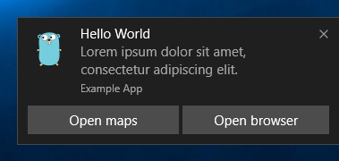

# Toast

A go package for Windows 10 toast notifications.

As seen in [jacobmarshall/pokevision-cli](https://github.com/jacobmarshall/pokevision-cli).

## CLI

As well as using go-toast within your Go projects, you can also utilise the CLI - for any of your projects.

Download [64bit](https://go-toast-downloads.s3.amazonaws.com/v1/toast64.exe) or [32bit](https://go-toast-downloads.s3.amazonaws.com/v1/toast32.exe)

```cmd
C:\Users\Example\Downloads\toast64.exe \
  --app-id "Example App" \
  --title "Hello World" \
  --message "Lorem ipsum dolor sit amet, consectetur adipiscing elit." \
  --icon "C:\Users\Example\Pictures\icon.png" \
  --audio "default" --loop \
  --duration "long" \
  --activation-arg "https://google.com" \
  --action "Open maps" --action-arg "bingmaps:?q=sushi" \
  --action "Open browser" --action-arg "http://..."
```



## Example

```go
package main

import (
    "log"

    "gopkg.in/toast.v1"
)

func main() {
    notification := toast.Notification{
        AppID: "Example App",
        Title: "My notification",
        Message: "Some message about how important something is...",
        Icon: "go.png", // This file must exist (remove this line if it doesn't)
        Actions: []toast.Action{
            {"protocol", "I'm a button", ""},
            {"protocol", "Me too!", ""},
        },
    }
    err := notification.Push()
    if err != nil {
        log.Fatalln(err)
    }
}
```

## Screenshots


## Troubleshooting

As of the 2019 Fall Creator's Update, Windows added a requirement that a 
notification AppIDs [must match the AppId of an application in the start menu](https://stackoverflow.com/questions/46814858/toast-notification-not-working-on-windows-fall-creators-update). 

To find the AppIds for Start Menu Applications, open up PowerShell and run:

```cmd 
Get-StartApps
```
While you can use any pinned application's AppID, it's probably 
not a bad idea to build your code into an executable, pin that to the start menu, 
and use its AppId. Note - since the AppId can belong to any application in the system, you can continue to use Go to run your code, instead of rebuilding and running the executable every time.

If your notifications are still not showing up, make sure the notification
settings are set properly for the AppId you used. You can configure 
this behavior from the `Notifications & Action Settings` menu in Windows. 
If your application is not showing up, you may need to send a push notification once for it to appear on the list.

Finally, make sure your system notifications are correctly configured to appear. Refer to [this guide](https://www.guidingtech.com/fixes-for-notifications-banners-not-showing-windows-10/) for some tips and tricks.
